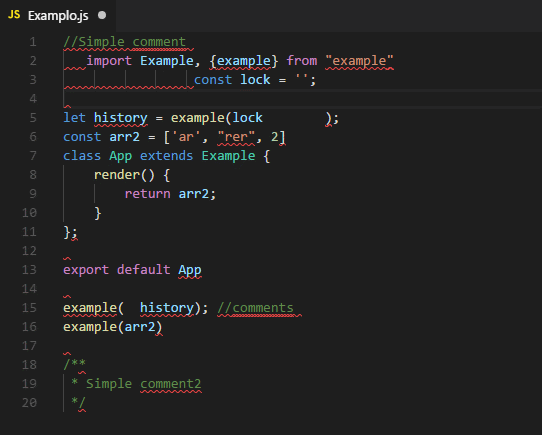

# ESLint Plugin Eiskaffee

It is just a simple styleguide.

[](https://github.com/brunomacedo/eslint-config-eiskaffee) [](https://www.npmjs.com/package/eslint-config-eiskaffee)

## Installation

```prompt
npm i -D eslint-config-eiskaffee
```

## Usage
Create the file `.eslintrc`.

```json
{
  "extends": "eiskaffee"
}
```

## Fix litte bugs

Create this command in your `package.json` to fix automatically litte bugs like breaklines and convert quotes.

```json
"scripts": {
	"esfix": "./node_modules/.bin/eslint --fix \"**/*.{js,jsx}\""
}
```

```prompt
npm run esfix
```


