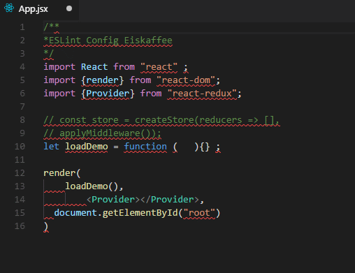

# Styleguide project rules

It is just a simple styleguide, so If you prefer indentation with tabs and if you would like to contribute to the project, be free.

[](https://github.com/brunomacedo/eslint-config-eiskaffee) [](https://www.npmjs.com/package/eslint-config-eiskaffee)

## Installation

```prompt
npm i -D eslint eslint-plugin-import eslint-plugin-react
```

```prompt
npm i -D eslint-config-eiskaffee
```

## Usage

Create the file `.eslintrc`.

```json
{
  "extends": "eiskaffee"
}
```

## Fix litte bugs

Create this command in your `package.json` to fix automatically litte bugs like breaklines and convert quotes.

```json
"scripts": {
  "esfix": "./node_modules/.bin/eslint --fix \"**/*.{js,jsx}\""
}
```

```prompt
npm run esfix
```

## VS Code ESLint extension 

You have to install [ESLint Extension](https://marketplace.visualstudio.com/items?itemName=dbaeumer.vscode-eslint) into VS Code first.

## Auto fix on save

If you've been using VS Code, try this config below in your `vscode-settings`. It should be fix your code from the **ESLint** config.
If you know how to configure it in another editors, just contribute with this project ;)

```json
"eslint.autoFixOnSave": true
```


